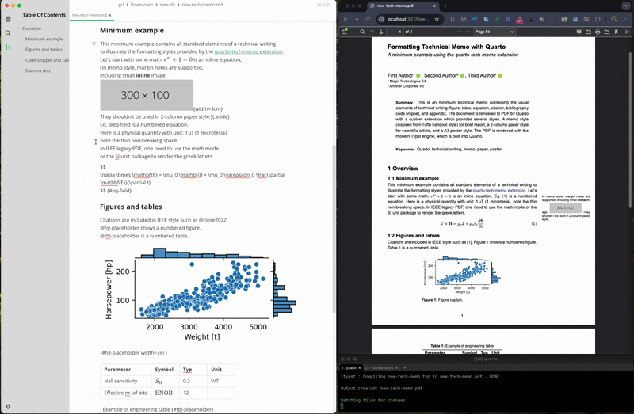

# Quarto Tech Memo

> See [the companion medium article](https://medium.com/@gcl-75380/formatting-technical-memos-with-quarto-89b2d3583060) for more background.


This is a [quarto extension](https://quarto.org/) to create brief technical memos in PDF 
with the modern and ⚡fast Typst engine (built into Quarto).
The memo style provides a professional single-column PDF layout 
with ample room for sidenotes and small figures in the margin.
Inspired by [Tufte handout style](https://rstudio.github.io/tufte/).
The intended use is for brief technical memos and preprints of scientific articles.
In addition, a 2-column compact variant and a 3-column A3 poster variants are provided.
For reference, a legacy IEEE paper style is also included---using the LaTeX engine.
Finally a slide deck variant using the [Clean Slide Theme](https://typst.app/universe/package/touying-quarto-clean/) is provided. 

The following screenshot shows all variants of the same document.
**All are formatted from the same source** in a few seconds
(the IEEE style, with the legacy Latex engine, dominates the rendering time).
All generated PDF files are included in the [examples](examples) folder.


## Usage in an existing quarto project

To use in an existing Quarto project as an extension, run

```bash
# For just the 1-column variant
quarto add gael-close/quarto-tech-memo@just-memo1

# For all variants
quarto add gael-close/quarto-tech-memo

# render with 
quarto render your-file.md --to memo1-typst
```

## Usage as a template from scratch

Install [Quarto](https://quarto.org/docs/get-started/),
then install extra Python dependencies with:

```bash
pip install invoke cookiecutter
```

To render the provided example:

```bash
cookiecutter -f gh:gael-close/quarto-tech-memo; cd new-dir;
quarto render new-tech-memo.md 
```

For the variants, use one of the flags `--to memo2-typst`, `--to memo3-typst`, `--to slides-typst`, `--to poster-typst`, or `--to ieee-pdf` 

Edit `new-tech-memo.md` in your favorite editor and re-run the render command
or preview changes (one every save) live with:

```bash
quarto preview new-tech-memo.md
```




## Usage as a Python CLI tool

Once can also use this as a standalone command-line-interface tool 
to create a new PDF memo from an existing markdown file.
The [uv package manager](https://docs.astral.sh/uv/) must be installed for this to work---one liner install instructions are provided on the website. 
`uv tool install` will install all dependencies (including Quarto) in an isolated environment,
and make the tool available in your shell.

```bash
# Install (only needed once)
uv tool install git+https://github.com/gael-close/quarto-tech-memo

# Usage
quarto-tech-memo new-tech-memo.md --to memo1
```

---

## Details

* The memo template is based on: https://github.com/kazuyanagimoto/quarto-academic-typst.
* The margin notes are formatted by the [marginalia](https://typst.app/universe/package/marginalia/) package.
* In markdown, margin notes are should created with the `.aside` class: 
  see https://quarto.org/docs/authoring/article-layout.html#asides. 
  Note that this should be inline with the surrounding pargaraph (like a footnote).
* Margin notes don't make sense in 2-column style. 
They are still included inline in the main paragraph nevertheless.
* The slides template is taken from https://typst.app/universe/package/touying-quarto-clean/.
* Custom Lua filters are included for various tweaks.

## Development

Run a test suite with [Invoke](https://www.pyinvoke.org/). 
This will format the example memo in all variants.

```bash
invoke test (--gh) (--no-ieee)
```

The `--gh` flag uses the GitHub repo instead of a local copy of the extension.
The `--no-ieee` flag skips the legacy IEEE format which requires a LaTeX installation (install via: `quarto install tinytex`)

To extract the conversion time for a given format:

```bash
invoke conversion-time --format memo1-typst
```
### Lua filters

To run the Lua filter standalone on a test file `dev.md`:

```
cd _extensions/meme1/lua-filters
quarto pandoc dev.md -t typst --lua-filter custom.lua
```

### Run as uv tool

Install the tool from the local copy of the repo with:
```bash
uv tool install $B4/quarto-tech-memo
```

