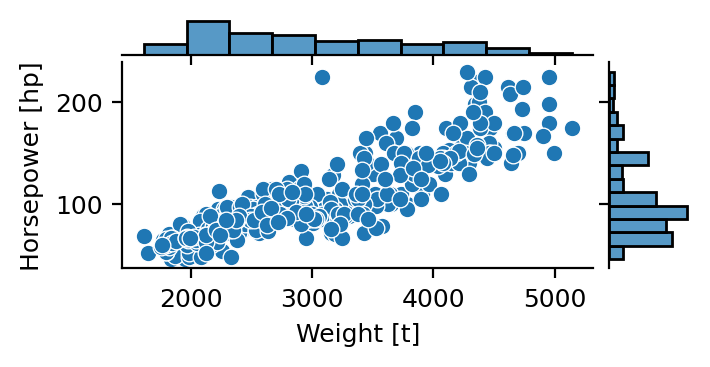

## Overview 

The document contains all standard elements of a technical writing.
$f(x)=x^2$ is an inline equation while eq. @eq-field is a numbered equation.
[In memo style, margin notes are supported, including small **inline** image and equation $e^{\pi i} + 1 = 0$.
{width=3cm}  
They shouldn't be used in 2-column paper style.]{.aside}
@close2022 is a citation in IEEE style.
@fig-placeholder shows a numbered figure.
@tbl-placeholder is a numbered table.
Here is a physical quantity: 1 μT (1 microtesla), note the thin non-breaking space.
In IEEE legacy PDF, one need to use the math mode or the SI unit package to render the greek letters.
Syntax highlighting is supported in code snippets.
Moreover, callout boxes are available for tips, notes, warnings, and important remarks.

$$
\nabla \times \mathbf{B} = \mu_0 \mathbf{J} + \mu_0 \varepsilon_0 \frac{\partial \mathbf{E}}{\partial t} 
$$ {#eq-field}

<!-- Uncomment to populate with more dummy text 

{#fig-placeholder} 
-->

{#fig-placeholder width=3in }

| Parameter             | Symbol          | Typ | Unit |
| :-------------------- | --------------- | --- | ---- |
| Hall sensitivity      | $S_\mathrm{H}$  | 0.2 | V/T  |
| Effective nr. of bits | $\mathrm{ENOB}$ | 12  | -    |

: Example of engineering table {#tbl-placeholder}




```python
def f(x, square=True):
    # Python code snippet
    return (x**2) if square else x
```

::: {.callout-note title="Markdown syntax"}
The document is written in Markdown, a plain-text **easy syntax**. See the 
[Quarto documentation](https://quarto.org/docs/authoring/markdown-basics.html).
:::

**DUMMY TEXT**. **